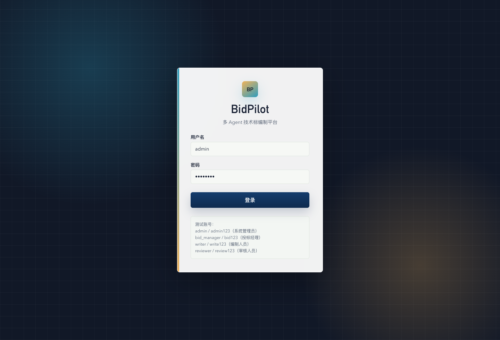
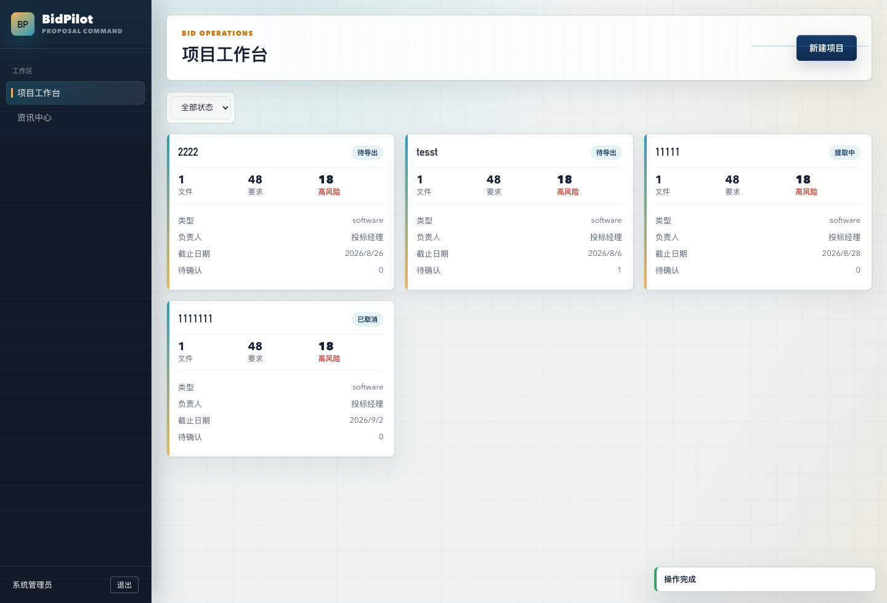
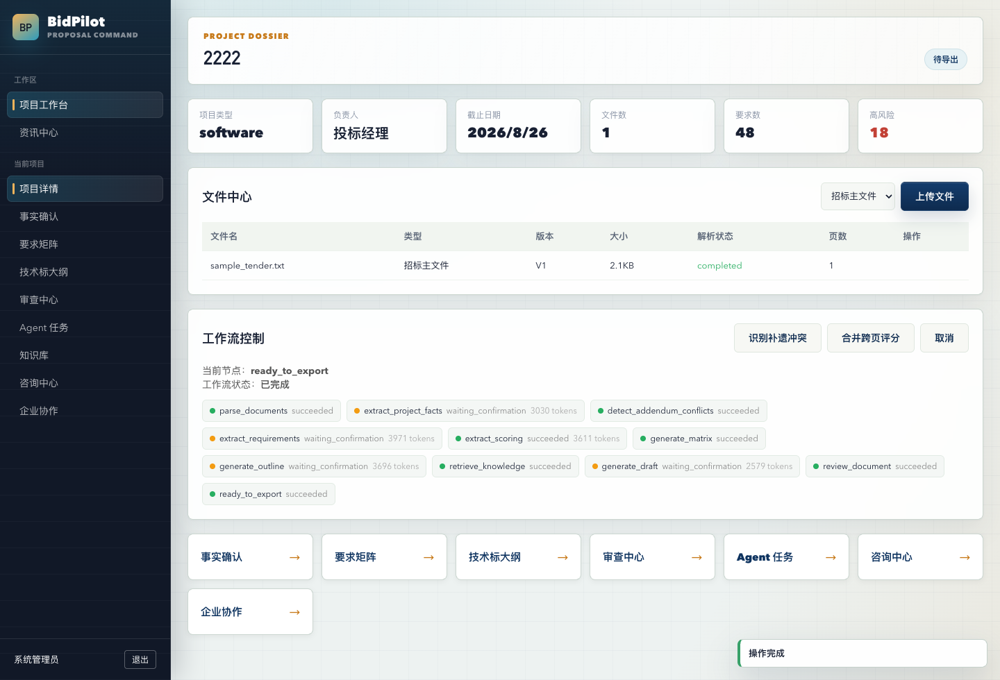
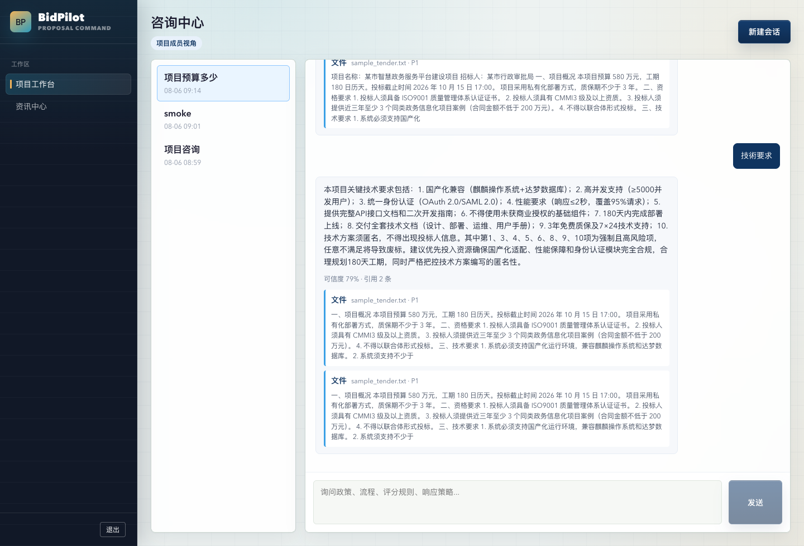
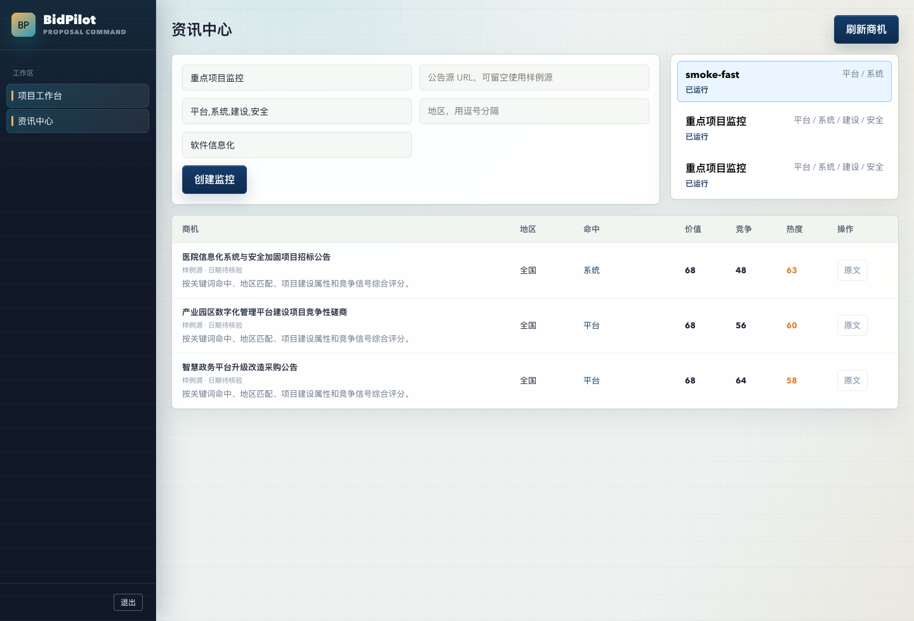

# BidPilot - AI 智能投标作战平台

<div align="center">


**招标文件解析 · 多 Agent 工作流 · 技术标生成 · 可解释置信度 · 咨询中心 · 商机监控**

[项目简介](#项目简介) • [界面预览](#界面预览) • [核心特色](#核心特色) • [技术架构](#技术架构) • [快速开始](#快速开始) • [项目结构](#项目结构)

</div>

> BidPilot 是面向投标团队的 AI 辅助编制平台。系统以 FastAPI + Vue 3 为基础，集成 DeepSeek / OpenAI-compatible LLM 网关、RAG 知识库、SSE 进度流和企业协作能力，覆盖从招标文件上传、需求抽取、事实确认、技术标大纲、章节初稿、合规审查到 Word 导出的核心流程。

---

## 项目简介

传统投标工作往往依赖人工反复阅读招标文件、整理评分项、确认关键事实、拆分章节任务并撰写响应内容。BidPilot 将这些步骤拆成可追踪的 Agent 工作流，并把每个关键结果与原文来源、置信度和人工确认状态关联起来。

平台当前重点解决：

- **招标文件解读**：解析 PDF / DOCX / XLSX / TXT，抽取项目事实、资格要求、技术要求、评分项。
- **技术标生成**：自动生成技术标大纲，并结合企业知识库生成章节初稿。
- **可解释置信度**：不只展示模型分数，而是量化来源完整性、原文命中、文本具体性、冲突状态和人工确认。
- **全过程进度可见**：SSE 实时推送 Agent 节点、模型调用、结构化返回和失败信息。
- **项目咨询中心**：基于招标文件、知识库和项目上下文进行多轮问答，并自动附带引用片段。
- **资讯中心**：配置公告源、关键词和地区，快速筛选潜在商机并评估价值、竞争程度和热度。
- **企业协作**：项目成员、章节分配、锁定编辑、审批流、审计日志和行业模板。

---

## 界面预览

| 页面 | 预览 |
| :--- | :---: |
| **登录入口** |  |
| **项目工作台** |  |
| **项目详情 / 文件中心 / 工作流控制** |  |
| **咨询中心** |  |
| **资讯中心** |  |

---

## 核心特色

### 1. 多 Agent 投标工作流

- **文档解析 Agent**：统一解析招标主文件、技术规范、评分表、补遗和企业材料。
- **要求抽取 Agent**：提取资格、技术、商务、交付、格式、评分等要求。
- **事实抽取 Agent**：识别项目名称、招标人、预算、工期、截止日期等关键字段。
- **评分 Agent**：抽取评分项，支持跨页评分合并。
- **大纲 / 草稿 Agent**：基于项目要求和知识库生成技术标大纲与章节初稿。
- **审查 Agent**：对覆盖度、风险点、一致性和缺失响应进行检查。

### 2. 可解释置信度评分

BidPilot 的置信度不是单纯沿用模型返回值，而是拆分为多个可量化因子：

| 因子 | 说明 |
|------|------|
| 模型先验 | LLM 或规则抽取阶段给出的原始置信度 |
| 来源完整性 | 是否有来源文件、页码、文件哈希、解析状态 |
| 原文命中 | 抽取结果是否能在对应文件页中命中 |
| 文本具体性 | 是否包含金额、日期、百分比、期限等具体信息 |
| 冲突状态 | 是否存在待处理补遗冲突或人工确认任务 |
| 人工确认 | 已确认字段会获得额外可信加权 |

前端会显示高 / 中 / 低等级、百分比和解释提示，便于投标经理判断哪些信息必须复核。

### 3. RAG 企业知识库

- 支持企业产品资料、案例材料、资质材料、技术架构、实施方案等知识入库。
- 内置 hash-vector embedding，结合向量相似度与关键词得分进行混合检索。
- 草稿生成和咨询问答均可引用知识库片段。
- 支持知识审核状态，避免未审核材料进入正式生成链路。

### 4. 咨询中心

- **AI 智能问答**：围绕招标文件、项目事实、需求矩阵和知识库回答政策、流程、规则问题。
- **多轮对话**：保存会话和消息，可围绕同一问题逐步细化。
- **资料引用**：回答自动附带文件页码或知识库片段，便于追溯。
- **角色化回复**：管理员、投标经理、编制人员、审核人员会得到不同侧重点建议。

### 5. 资讯中心

- **商机监控**：配置公告源 URL，抓取公告链接并入库。
- **关键词过滤**：按行业、地区、关键词匹配潜在项目。
- **热度分析**：从项目价值、竞争强度和关键词命中计算热度分。
- **快速响应**：默认使用公式量化，避免列表刷新被逐条 LLM 调用拖慢。

### 6. 企业协作与审计

- 项目成员管理与角色权限。
- 章节负责人分配、章节锁定和审批流。
- WebSocket 在线协作 presence。
- 高危操作写入审计日志。
- 软件、建设、医疗、教育等行业模板可一键套用。

---

## 技术架构

```text
┌──────────────────────────────────────────────────────────────┐
│                         Vue 3 前端                           │
│  工作台 / 文件中心 / 事实确认 / 要求矩阵 / 大纲 / 咨询 / 资讯 │
└──────────────────────────────┬───────────────────────────────┘
                               │ REST / SSE / WebSocket
┌──────────────────────────────▼───────────────────────────────┐
│                       FastAPI 后端                            │
│  Auth / Projects / Documents / Bid / Workflow / Knowledge     │
│  Enterprise / Consultation / Information                      │
├───────────────────────────────────────────────────────────────┤
│                         Agent 层                              │
│  DocumentAgent / RequirementAgent / ScoringAgent              │
│  RetrievalAgent / DraftingAgent / ReviewAgent                 │
│  CommercialAgent / QualificationAgent / AddendumAgent         │
├───────────────────────────────────────────────────────────────┤
│                         AI 能力层                             │
│  DeepSeek / OpenAI-compatible LLM Gateway                     │
│  Task Model Routing / Token Usage / Cost Estimate             │
│  Hash Vector RAG / Structured JSON Output                     │
├───────────────────────────────────────────────────────────────┤
│                         数据与文件                            │
│  SQLAlchemy Async ORM / SQLite MVP / Uploads / Word Export    │
└───────────────────────────────────────────────────────────────┘
```

### 技术栈

| 模块 | 技术 |
|------|------|
| 后端 | FastAPI、SQLAlchemy Async、Pydantic、SSE-Starlette、python-docx |
| 前端 | Vue 3、Vue Router、Pinia、Axios、Vite |
| 文档解析 | pdfplumber、pypdf、python-docx、openpyxl |
| AI 网关 | DeepSeek / OpenAI-compatible Chat Completions |
| RAG | Hash Embedding、Cosine Similarity、Keyword Hybrid Search |
| 协作 | WebSocket、审批流、审计日志 |
| 部署 | Docker Compose、Helm Chart 骨架、一键本地启动脚本 |

---

## 快速开始

### 环境要求

- Python 3.12+
- Node.js 18+
- npm

### 方式一：一键启动

```bash
git clone https://github.com/Router0824/BidPilot-AI.git
cd BidPilot-AI
./start.sh
```

启动时会询问是否启用真实 DeepSeek API：

- 输入 `n`：使用 mock 模型，本地演示不消耗 API。
- 输入 `y`：在终端输入 API Key，仅注入本次进程环境，不写入文件。

访问地址：

- 前端：http://localhost:5173
- 后端 API：http://localhost:8000/docs

### 方式二：手动启动

```bash
# 后端
pip install -r requirements.txt
python -m uvicorn app.main:app --host 127.0.0.1 --port 8000 --reload

# 前端
cd frontend
npm install
npm run dev
```

### 默认测试账号

| 用户名 | 密码 | 角色 |
|--------|------|------|
| `admin` | `admin123` | 系统管理员 |
| `bid_manager` | `bid123` | 投标经理 |
| `writer` | `write123` | 编制人员 |
| `reviewer` | `review123` | 审核人员 |

---

## 配置说明

复制 `.env.example` 为 `.env` 后可自定义配置：

```bash
cp .env.example .env
```

| 变量 | 说明 | 默认值 |
|------|------|--------|
| `BIDPILOT_DATABASE_URL` | 数据库连接 | `sqlite+aiosqlite:///./bidpilot.db` |
| `BIDPILOT_UPLOAD_DIR` | 上传目录 | `./uploads` |
| `BIDPILOT_LLM_PROVIDER` | 模型供应商 | `mock` |
| `BIDPILOT_LLM_API_KEY` | LLM API Key | 空 |
| `BIDPILOT_LLM_BASE_URL` | OpenAI-compatible 地址 | `https://api.deepseek.com` |
| `BIDPILOT_LLM_FAST_MODEL` | 快速任务模型 | `deepseek-v4-flash` |
| `BIDPILOT_LLM_QUALITY_MODEL` | 高质量生成模型 | `deepseek-v4-pro` |

---

## 项目结构

```text
.
├── app/                       # FastAPI 后端
│   ├── agents/                # Agent 与 LLM Gateway
│   ├── api/v1/                # REST / SSE / WebSocket API
│   ├── application/           # 应用服务
│   ├── core/                  # 配置、数据库、认证
│   ├── domain/                # SQLAlchemy ORM 模型
│   ├── observability/         # 进度事件总线
│   ├── realtime/              # 协作 WebSocket
│   └── workflows/             # 工作流引擎
├── frontend/                  # Vue 3 前端
│   ├── src/pages/             # 业务页面
│   ├── src/stores/            # Pinia Store
│   └── src/components/        # 通用组件
├── deploy/helm/               # 私有化部署 Helm 骨架
├── docs/images/               # README 预览图
├── scripts/dev_start.py       # 前后端一键启动脚本
├── start.sh                   # 本地启动入口
└── requirements.txt           # Python 依赖
```

---

## API 文档

启动后访问：

- Swagger UI：http://localhost:8000/docs
- 健康检查：http://localhost:8000/health/live

核心接口：

- `/api/v1/projects`
- `/api/v1/projects/{project_id}/documents`
- `/api/v1/projects/{project_id}/workflow`
- `/api/v1/projects/{project_id}/confidence/report`
- `/api/v1/projects/{project_id}/consultation/sessions`
- `/api/v1/information/monitors`
- `/api/v1/knowledge`
- `/api/v1/projects/{project_id}/enterprise`

---

## 当前状态

这是一个可本地演示、可继续产品化扩展的 MVP 版本。SQLite、hash-vector RAG 和 mock LLM 让项目可以低成本跑通；生产环境建议切换 PostgreSQL、对象存储、任务队列和更稳定的模型网关。

---

<div align="center">

**BidPilot · 让投标团队从重复整理中解放出来**

如果这个项目对你有帮助，欢迎 Star。

</div>
