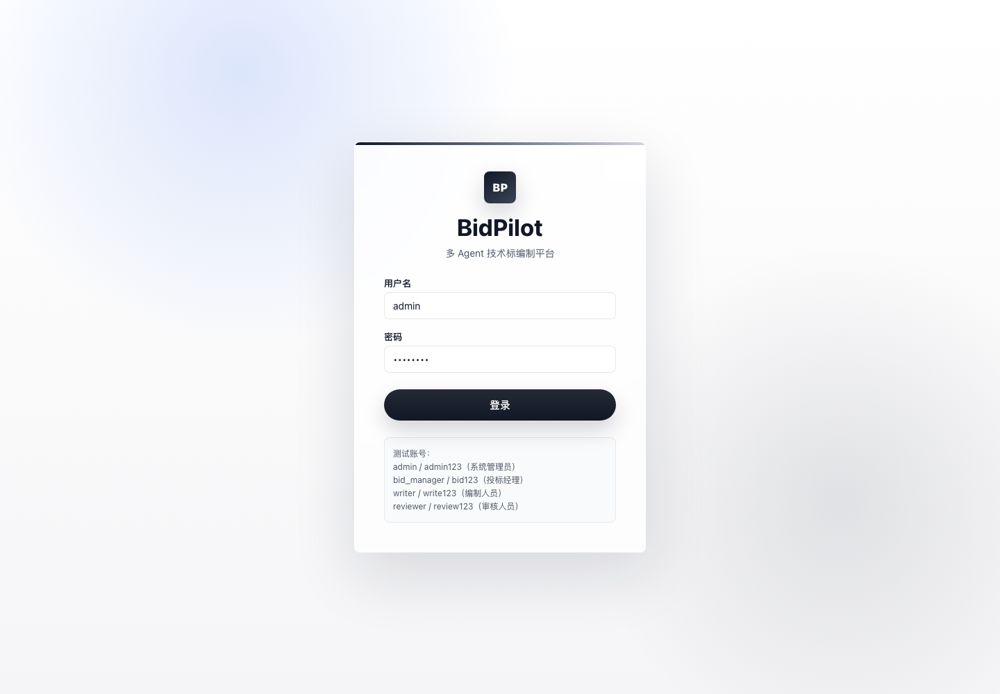
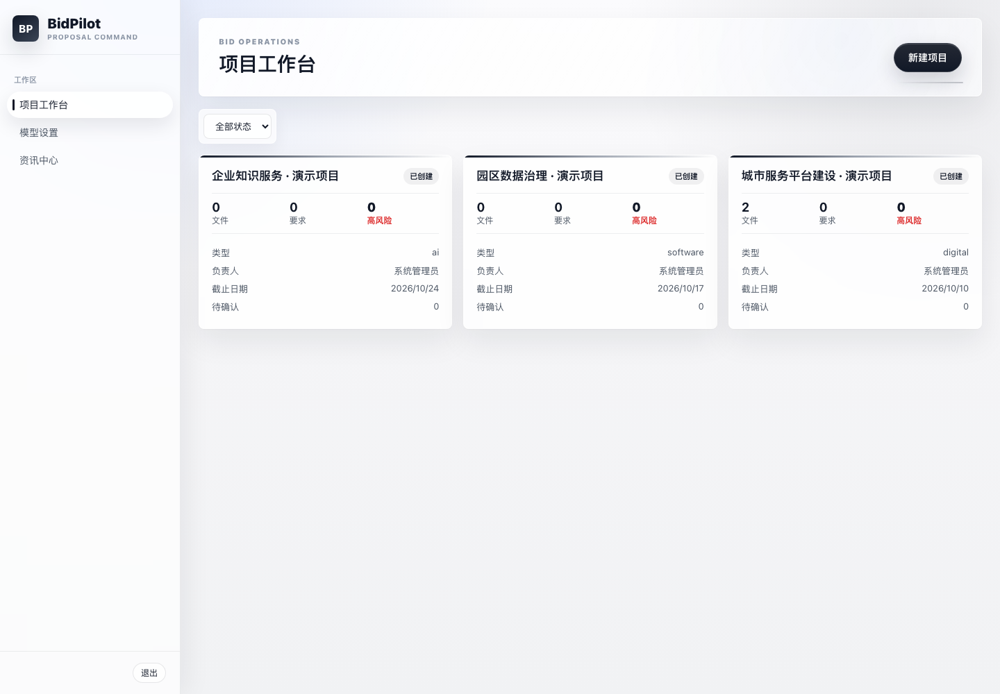
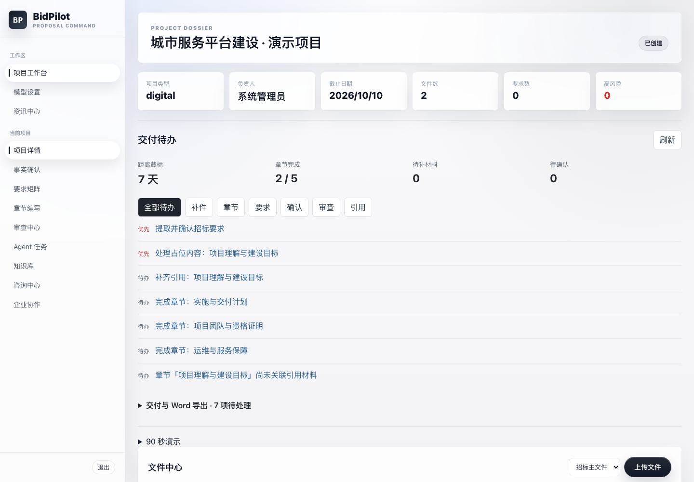
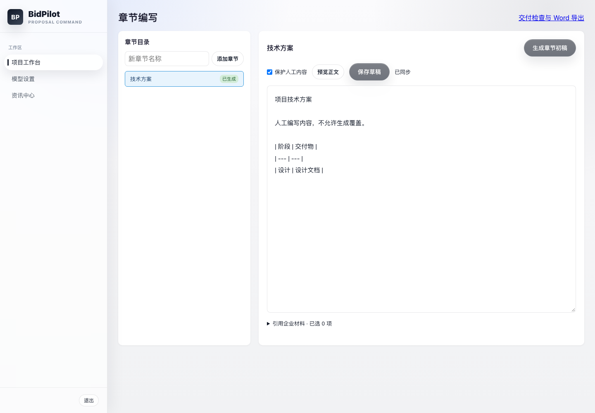
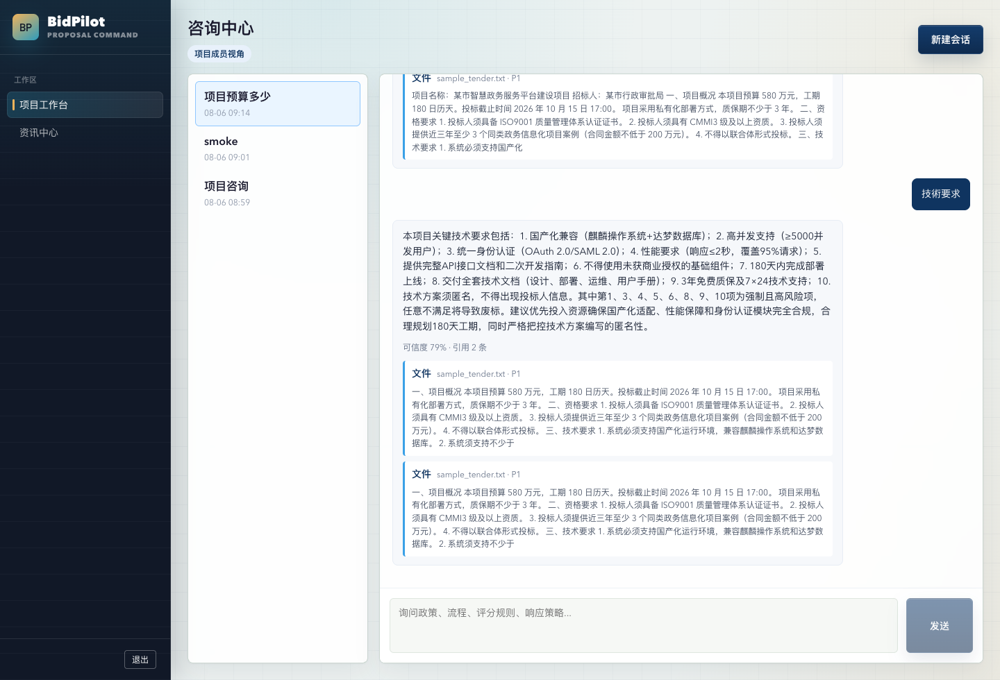
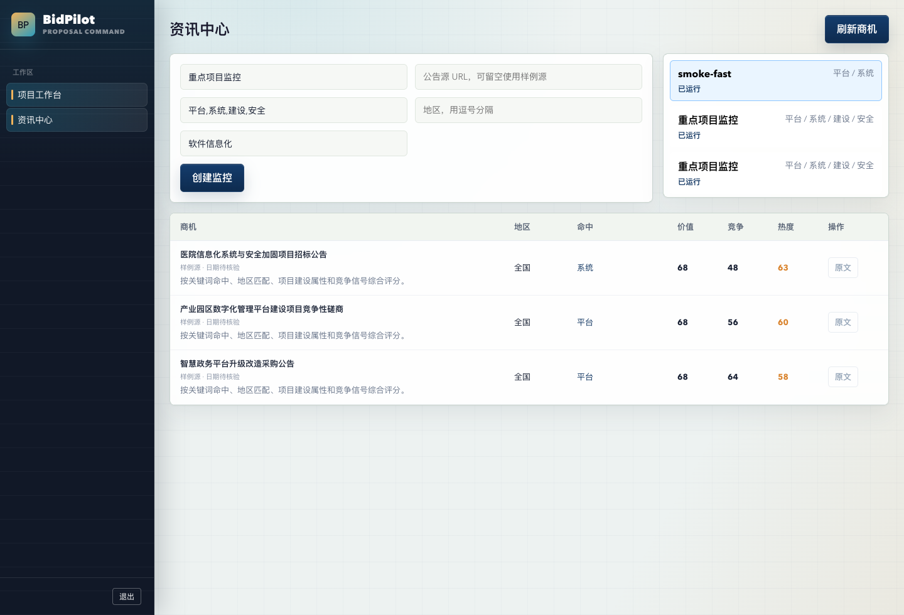

---
domain:
  - nlp
tags:
  - agent
  - fastapi
  - vue
  - bid-document
deployspec:
  entry_file: app.py
license: Apache License 2.0
---

# BidPilot-AI 智能投标 Agent 平台

<div align="center">


**项目待办 · 章节编写 · 企业材料复用 · 证据追溯 · 审查确认 · Word 交付**

[界面预览](#界面预览) · [核心能力](#核心能力) · [快速开始](#快速开始) · [模型设置](#模型设置) · [Demo 流程](#demo-流程) · [部署说明](#部署说明)

</div>

BidPilot-AI 是一个面向投标团队的 AI Agent 工作台。从招标文件解析、补遗影响分析，到章节编写、材料引用、审查确认和 Word 导出，把分散的编制任务串成可追溯的交付流程。人工修改保留历史版本，重要承诺交由人员确认，日常工作与 Agent 自动化在同一项目中协作。

项目保留轻量 Mock 模式：没有 API Key 也能体验流程；需要真实模型时，管理员可在“模型设置”配置当前部署实例使用的 API。

## v1.1.0 更新

| 重点 | 本版变化 |
| :--- | :--- |
| 编制工作台 | 按真实项目数据汇总待办、截标时间、缺失材料和交付阻塞项。 |
| 章节版本 | 人工编辑、内容保护、版本对比、并发冲突检测，避免覆盖已保存内容。 |
| 交付模板 | DOCX 模板字段校验、正文插入位置、范本下载和恢复默认模板。 |
| 模型连接 | 测试未保存配置，明确错误原因，更新 DeepSeek 模型默认值；真实生成失败不冒充成功草稿。 |
| 验证 | 后端业务测试、桌面与移动端浏览器测试、GitHub Actions 自动检查。 |

---

## 界面预览

| 页面 | 说明 | 预览 |
| :--- | :--- | :---: |
| 登录入口 | Mock 演示账号默认填充，适合评委快速进入系统。 |  |
| 项目工作台 | 项目状态、风险、文档和工作流概览。 |  |
| 项目详情 | 文件上传、Demo 入口、Agent 主舞台入口。 |  |
| 章节编写 | 人工草稿保存、内容保护和企业材料引用。 |  |
| 咨询中心 | 基于项目上下文和知识库的问答，并展示引用来源。 |  |
| 资讯中心 | 商机监控、关键词筛选和机会热度分析。 |  |

---

## 核心能力

### 日常编制与交付

| 工作步骤 | 可用功能 |
| :--- | :--- |
| 查看待办 | 项目详情展示截标倒计时、章节完成数、缺失材料和待确认事项，可分类筛选并跳转处理。 |
| 编写章节 | 新增章节、人工编辑、保存版本、历史对比和单章生成；人工保存默认开启内容保护。 |
| 复用材料 | 企业材料可记录有效期、适用范围和来源；正文可选择已审核材料作引用，过期材料不参与检索。 |
| 核对响应 | 将要求关联到具体章节，人工核对后标记已响应；章节改变后需重新确认。 |
| 处理审查 | 刷新后仍可查看问题、定位章节、填写处理说明或忽略理由；高风险由审核人员确认。 |
| Word 交付 | 上传企业 DOCX 模板，沿用其样式并保留模板原内容，生成标题层级、表格、目录域和页码。 |

**建议使用顺序：** 项目详情查看待办 → 章节编写与引用材料 → 要求矩阵确认响应 → 审查中心复查 → 返回项目详情导出 Word。

- 修改正文会创建新版本，不覆盖历史内容。并发保存发生冲突时返回提示，编辑器保留未保存正文。
- 解除内容保护后才允许生成或 Fixer 更新该章；即使生成较慢，也不能覆盖期间保存的新版本。
- 工作草稿可随时下载；正式稿在未完成章节、未确认要求、失效引用、占位内容或未处理审查问题清除后开放。
- Word 目录使用标准域，请在 Word 中选择“更新域”。模板支持 `{{project_name}}`（项目名称）、`{{company_name}}`（投标单位）、`{{content}}`（正文位置）。名称字段可用于正文、表格和页眉页脚；正文占位符必须独占正文中的一个段落，且最多一个。未设置正文占位符时，正文追加到模板末尾。
- 在交付区下载“模板范本”，调整样式后上传；页面显示已识别字段和正文插入方式。不支持的字段或无效正文位置会拒绝上传，原模板保持不变。也可恢复默认模板。
- 90 秒演示收纳在项目详情的折叠入口中，原有演示和固定工作流保留。

### 升级与验证

已有 SQLite 数据库在应用启动时自动创建 `section_protections`、`material_metadata`、`export_profiles` 三张新表，不删除或改写原有表结构。升级前应备份数据库及 `uploads/`；回滚应用代码时可保留这三张附加表，已有正文版本仍位于原 `draft_versions` 表中。

```bash
# 后端业务测试：使用临时数据库，不修改本地项目
.venv/bin/python -m unittest discover -s tests -v

# 前端构建
npm --prefix frontend run build

# 浏览器验收：自动启动本地服务，创建并清理专用测试项目
npx --prefix frontend playwright install chromium
npm --prefix frontend run test:e2e
```

### Agent 自主规划

- Planner Agent 根据项目、文件类型、补遗、已完成节点、风险项和审查结果输出结构化计划。
- Planner 输出经过 Pydantic 校验，非法输出会回退到固定工作流。
- 前端展示执行原因、跳过原因、人工确认原因和当前计划图。

### 动态工作流与增量重执行

- 工作流节点定义包含输入、输出、依赖、失效来源、超时、重试、风险等级和人工确认策略。
- 新增补遗文件或人工确认变更后，系统计算受影响节点，只重跑必要下游。
- 前端提供“执行前预览”：清楚展示会重跑和不会重跑的节点。

### 响应证据图谱

- 建立“招标原文 -> 结构化要求 -> 风险等级 -> 投标章节 -> 企业材料 -> 生成内容 -> 审查结果”的链路。
- 要求覆盖矩阵展示页码、原文片段、要求类型、分值、风险、章节、材料、覆盖状态和置信度。
- 点击要求可查看完整证据链，避免只依赖模型解释。

### Reviewer/Fixer 闭环

- Reviewer 输出结构化问题，包括缺失响应、部分覆盖、内部冲突、引用不足、补遗冲突、资质风险等。
- Fixer 仅自动处理低风险问题；资格、报价、工期承诺、法律声明等高风险内容必须人工确认。
- 每个章节自动修正有最大次数限制，并保存修改前后内容。

### 可演示的工程稳定性

- 保留固定工作流作为降级方案。
- 保留 Mock LLM，适合公开演示和无 Key 环境。
- 支持 SSE 工作流进度、SQLite 本地数据库、Docker Compose 和 ModelScope 单容器部署。
- 前端提供 90 秒 Demo 引导层，评委无需猜点击顺序。

---

## 技术架构

```text
Vue 3 Frontend
  - Project Dashboard
  - Workflow Stage
  - Evidence Matrix
  - Review/Fix Center
  - LLM Settings
        |
        | REST / SSE / WebSocket
        v
FastAPI Backend
  - Auth / Projects / Documents
  - Bid / Workflow / Knowledge
  - Consultation / Information / System
        |
        v
Agent Layer
  - Planner Agent
  - Document / Requirement / Scoring Agents
  - Retrieval / Drafting / Review Agents
  - Mock or OpenAI-compatible LLM Gateway
        |
        v
SQLite + Uploads + Runtime Config
```

| 模块 | 技术 |
| --- | --- |
| 后端 | FastAPI, SQLAlchemy Async, Pydantic, SSE |
| 前端 | Vue 3, Vue Router, Pinia, Axios, Vite |
| 数据库 | SQLite |
| 文档解析 | pdfplumber, pypdf, python-docx, openpyxl |
| LLM | Mock LLM, DeepSeek, OpenAI-compatible API |
| RAG | Hash Embedding, 关键词检索, 混合召回 |
| 部署 | Docker Compose, ModelScope Docker, 本地启动脚本 |

---

## 快速开始

### 环境要求

- Python 3.12+
- Node.js 22.12+（CI 使用 Node.js 22）
- npm

### 本地一键启动

```bash
git clone https://github.com/Router0824/BidPilot-AI.git
cd BidPilot-AI
cp .env.example .env
python3 -m venv .venv
source .venv/bin/activate
pip install -r requirements.txt
npm ci --prefix frontend
./start.sh
```

Windows 可用 `.venv\Scripts\Activate.ps1` 激活虚拟环境，并按下方“手动启动”分别运行前后端。
首次启动会自动创建 SQLite 数据库与所需表，无需额外数据库服务。

启动脚本会询问是否启用真实 DeepSeek API：

- 输入 `n`：使用 Mock 模式，不需要 API Key。
- 输入 `y`：按提示输入 API Key，仅用于当前运行环境。

若此前已在页面保存过模型配置，该配置优先于环境变量。需要回到 Mock 时，请在“模型设置”选择 Mock 并保存。

访问地址：

- 前端：http://localhost:5173
- 后端 API：http://localhost:8000/docs
- 健康检查：http://localhost:8000/health/ready

### 手动启动

后端：

```bash
python -m uvicorn app.main:app --host 127.0.0.1 --port 8000 --reload
```

前端：

```bash
cd frontend
npm ci
npm run dev
```

### Docker Compose

```bash
docker compose up --build
```

默认端口：

- 前端：http://localhost
- 后端：http://localhost:8080
- API 文档：http://localhost:8080/docs

数据库和运行时模型配置保存在 `bidpilot_db` 卷，上传文件保存在 `bidpilot_data` 卷。升级前备份这两个卷，不要使用 `docker compose down -v` 清除数据。本版将数据库卷挂载位置从 `/app` 调整为 `/app/data`，避免旧代码覆盖新镜像；旧卷根目录中的 `bidpilot.db` 和运行时配置可继续使用。

---

## 模型设置

BidPilot-AI 默认使用 Mock 模式，公开演示时无需 API Key。需要真实模型时，以管理员身份登录后进入左侧导航：

```text
模型设置
```

页面支持：

- 选择 `Mock / DeepSeek / OpenAI / Custom`
- 输入 API Key
- 配置 Base URL
- 配置默认模型、快速模型和高质量模型
- 设置超时、本进程估算成本上限和每千 Token 估算成本
- 点击“测试连接”验证当前表单中的默认模型，不保存 Key 或切换运行模式
- 测试通过后，点击“保存并启用”

安全说明：

- API Key 只保存在当前部署实例的本地运行时配置文件中。
- 页面不会回显明文 Key。
- `bidpilot_runtime_config.json` 已加入 `.gitignore` 和 `.dockerignore`。
- 公共 Demo 不建议预置个人 API Key。
- 模型配置属于整个部署实例，不是按用户隔离的个人密钥库；使用真实 Key 时应限制实例访问权限。
- 当前账号体系仍是演示实现，真实模型模式不会自动禁用演示账号。生产使用前必须替换认证、修改 JWT 密钥并增加访问控制与配额限制。

也可以使用环境变量：

```bash
BIDPILOT_LLM_PROVIDER=deepseek
BIDPILOT_LLM_API_KEY=your_api_key
BIDPILOT_LLM_BASE_URL=https://api.deepseek.com
BIDPILOT_LLM_MODEL=deepseek-flash
BIDPILOT_LLM_FAST_MODEL=deepseek-flash
BIDPILOT_LLM_QUALITY_MODEL=deepseek-v4-pro
```

DeepSeek 的连线探测使用非思考模式以控制测试开销，正式 Agent 任务不受影响。
快速模型与高质量模型可单独配置；默认模型连通不代表其他模型已通过验证。
已有配置不会被自动覆盖；请以 [DeepSeek 官方模型文档](https://api-docs.deepseek.com/quick_start/pricing/) 为准更新模型名。

---

## Demo 流程

初始化 Mock 演示数据：

```bash
python scripts/seed_demo_data.py
```

演示数据包含：

- 一份招标主文件
- 一份将工期从 120 天修改为 90 天的补遗文件
- 若干企业资质材料
- 一个故意缺失的资格证明
- 一个前后矛盾的服务响应时间

建议 90 秒演示路线：

1. 登录系统并进入项目详情。
2. 点击“90 秒演示开始”。
3. 查看 Planner Agent 计划图。
4. 展示补遗影响范围和增量重执行预览。
5. 确认高风险变更后运行受影响节点。
6. 打开响应证据图谱，点击要求查看完整证据链。
7. 打开审查中心，展示 Reviewer 问题和 Fixer 低风险修正。
8. 展示高风险问题进入人工确认，而不是自动改写。
9. 导出当前投标文档。

完整说明见：[docs/DEMO_GUIDE.md](docs/DEMO_GUIDE.md)

### 演示账号

这些账号仅供本地 Mock 演示，禁止用于生产环境。

| Username | Password | Role |
| --- | --- | --- |
| `admin` | `admin123` | System admin |
| `bid_manager` | `bid123` | Bid manager |
| `writer` | `write123` | Writer |
| `reviewer` | `review123` | Reviewer |

---

## 部署说明

### ModelScope

仓库包含 ModelScope 单容器部署入口：

- 根目录 `Dockerfile`
- 根目录 `app.py`
- `modelscope_release/server.py`
- `modelscope_release/start.sh`

推荐设置：

- 应用部署框架：`docker`
- 端口号：`7860`
- Mock 模式：无需额外环境变量
- 真实模型：可在前端“模型设置”填写，或在平台环境变量中配置

### 健康检查

```text
GET /health/live
GET /health/ready
```

---

## 项目结构

```text
.
├── app/                    # FastAPI 后端
│   ├── agents/             # Agent 与 LLM Gateway
│   ├── api/v1/             # REST / SSE / WebSocket API
│   ├── application/        # 应用服务
│   ├── core/               # 配置、认证、运行时模型配置
│   ├── domain/             # SQLAlchemy ORM 模型
│   └── workflows/          # 工作流与依赖图
├── frontend/               # Vue 3 前端
│   └── src/pages/          # 工作台、流程、证据图谱、模型设置等页面
├── docs/                   # Demo Guide 和 README 图片
├── modelscope_release/     # ModelScope 发布辅助文件
├── scripts/                # Demo 数据初始化脚本
├── tests/                  # 后端业务与模型连接测试
├── .github/workflows/      # 持续集成
├── Dockerfile              # 单容器部署
├── docker-compose.yml      # 本地 Docker Compose
└── start.sh                # 本地启动入口
```

---

## 常用命令

```bash
# 后端导入检查
python -m compileall app scripts modelscope_release app.py

# 前端构建
npm --prefix frontend run build

# 初始化 Demo 数据
python scripts/seed_demo_data.py
```

---

## 常见问题

- 登录后仍回到登录页：清理浏览器该域名的 localStorage，或重新登录。
- 前端无法调用 API：确认后端运行在 `http://localhost:8000`。
- Docker 后端不可达：使用 `http://localhost:8080/docs`。
- 真实模型连接失败：先在“模型设置”点击“测试连接”，确认 Base URL、模型名和 Key。
- 演示环境没有 Key：保持 Mock 模式即可完整演示。

---

## License

Apache License 2.0
